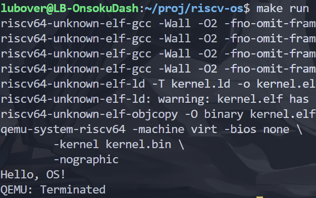

# 实验 1：RISC-V 引导与裸机启动

## 启动方式

```bash
>> make clean && make run
```

## 系统设计部分

### 系统架构部分

文件列表如下：

```text
.
├── kernel
│   ├── defs.h
│   ├── entry.S
│   ├── memlayout.h
│   ├── start.c
│   └── uart.c
├── kernel.ld
├── reports
├── scripts
└── test.c
```

其中核心文件的作用如下：

- kernel.ld：指定可执行文件的 entry point 为 `_entry`；分配和排布程序内存空间；定义内存定位标识符 `_bss_start` 等
- kernel/entry.S：`_entry` 定义位置；分配单线程栈空间；调用 `start`
- kernel/start.c：`start` 定义位置；为简单起见在 `start` 中置零 .bss 段和调用 `uart_puts`；调用 `main`
- kernel/uart.c：`uart_init` `uart_puts` 定义位置

### 与 xv6 对比分析

- 单线程处理

在 `_entry` 中，由于我的程序是单线程的，所以无须根据当前 hart 编号确定栈顶位置，写死为 stack0 + 4KB 即可

- start.c 简化

由于缺少太多实现，因此我的 `start` 简化为只清空 .bss 段，和按需初始化 uart 并调用 uart_puts

另外没有实现 supervisor mode 等，所以是直接调用 `main` 函数

- kernel.ld 简化

因为没有实现 trampoline，所以略去这部分初始化

## 实验过程部分

### 实验步骤

#### 1）实现 entry.S

只含有将 sp 置为编译期预留的栈的栈顶位置（`stack0` 标志确定，由于是全局变量，分配在 .bss 段中），比较简单，如下：

```S
.section .text
.global _entry
_entry:
        la sp, stack0
        li a0, 1024*4
        add sp, sp, a0

        call start

spin:
        j spin
```

#### 2）实现 start.c

xv6 源码将 `stack0` 的声明放在 start.c 中，我直接复制了其定义

另外，由于我在 `start` 中使用循环处理了 .bss 清零，也需要引入外部符号 `_bss_start` 和 `_bss_end`

最后，我在 `start` 中调用的 `uart_puts` 进行输出，将相应外部函数和初始化函数引入

```c
extern void uart_init( void );
extern void uart_puts( char* s );

extern char _bss_start[], _bss_end[];

void main();

// stack0 的值（地址）由链接器自动确定，其定义为数组的根本原因只是为了
// 在 .bss 段中分配一份足够大的空间作为栈空间而已
__attribute__( ( aligned( 16 ) ) ) char stack0[ 4096 ];

void start()
{
    // 清零 .bss 段
    for ( char* p = _bss_start; p < _bss_end; p++ )
    {
        *p = 0;
    }


    // 调用 uart 打印字符串
    uart_init();

    uart_puts( "Hello OS!\n" );

    main();
}
```

#### 3）实现 uart.c

uart 相关函数的定义放在 defs.h 中了，但是其他部分我暂时先用的 extern 来前置声明

在使用 uart 时，由于要使用外设，所以不可能只在 kernel 内存空间内操作，查看 xv6 源码，发现 xv6 的编译期将较低的一块地址映射为了 uart 的操作空间：

```c
// 该内容实际上放在 memlayout.h 中

// Physical memory layout

// qemu -machine virt is set up like this,
// based on qemu's hw/riscv/virt.c:
//
// 00001000 -- boot ROM, provided by qemu
// 02000000 -- CLINT
// 0C000000 -- PLIC
// 10000000 -- uart0 
// 10001000 -- virtio disk 
// 80000000 -- qemu's boot ROM loads the kernel here,
//             then jumps here.
// unused RAM after 80000000.

// the kernel uses physical memory thus:
// 80000000 -- entry.S, then kernel text and data
// end -- start of kernel page allocation area
// PHYSTOP -- end RAM used by the kernel

// qemu puts UART registers here in physical memory.
#define UART0 0x10000000L
#define UART0_IRQ 10
```

查看 uart 的实现，发现是典型的内存虚拟寄存器的处理器模式，因此将 uart 的寄存器相关宏照抄：

```c
#define Reg(reg) ((volatile unsigned char *)(UART0 + (reg)))

#define RHR 0                 // receive holding register (for input bytes)
#define THR 0                 // transmit holding register (for output bytes)
#define IER 1                 // interrupt enable register
#define IER_RX_ENABLE (1<<0)
#define IER_TX_ENABLE (1<<1)
#define FCR 2                 // FIFO control register
#define FCR_FIFO_ENABLE (1<<0)
#define FCR_FIFO_CLEAR (3<<1) // clear the content of the two FIFOs
#define ISR 2                 // interrupt status register
#define LCR 3                 // line control register
#define LCR_EIGHT_BITS (3<<0)
#define LCR_BAUD_LATCH (1<<7) // special mode to set baud rate
#define LSR 5                 // line status register
#define LSR_RX_READY (1<<0)   // input is waiting to be read from RHR
#define LSR_TX_IDLE (1<<5)    // THR can accept another character to send

#define ReadReg(reg) (*(Reg(reg)))
#define WriteReg(reg, v) (*(Reg(reg)) = (v))
```

并且将初始化函数直接照抄，因为不确定修改是否会破坏 xv6 uart 的使用规范：

```c
void uart_init( void )
{
    WriteReg( IER, 0x00 );
    WriteReg( LCR, LCR_BAUD_LATCH );
    WriteReg( 0, 0x03 );
    WriteReg( 1, 0x00 );
    WriteReg( LCR, LCR_EIGHT_BITS );
    WriteReg( FCR, FCR_FIFO_ENABLE | FCR_FIFO_CLEAR );
    WriteReg( IER, IER_TX_ENABLE | IER_RX_ENABLE );

    // 这里把 spinlock 初始化删掉了
}
```

然后先实现 `uart_putc`

观察宏的说明，显然我们需要使用到 THR 发送暂存寄存器，我们只要将内容写入 THR 中，硬件就会自动地将其中的 byte 输出到特定输出器

但是经过查阅发现，uart 底层的硬件发送速度可能远低于 CPU 运行内核发送字节的速度，因此需要读取 LSR 状态寄存器进行控制（不过这里简化了对可读事件的检测）

这里去掉了 spinlock 的实现，转而直接在 `uart_putc` 中直接实现一个简单的自旋，所以实际上实现的是 `usrt_putc`，如下：

```c
void uart_putc( char c )
{
    while ( ( ReadReg( LSR ) & LSR_TX_IDLE ) == 0 );

    // 这里似乎也是一个同步操作，硬件会在 write 后立刻设置 LSR_TX_IDLE 为 false
    WriteReg( THR, c );
}
```

那么 `uart_puts` 的实现就非常简单了：

```c
void uart_puts( char* s )
{
    while ( *s )
    {
        uart_putc( *s );
        s++;
    }
}
```

### 源码理解总结

我对源码的理解已经全部在实验步骤中体现了，这节实验没有什么好说的

只是我逐步开始理解其实在有了 riscv 编译器后，除了直接操作 sp 这些寄存器的地方还需要搓汇编，其他地方直接使用 C 编写即可  
或者说，C 本身就是一门直接与内存和二进制交互的底层语言，它如此地与汇编一致，以至于和原始人一样

## 测试验证部分

编写 Makefile 编译运行，测试结果如下：


