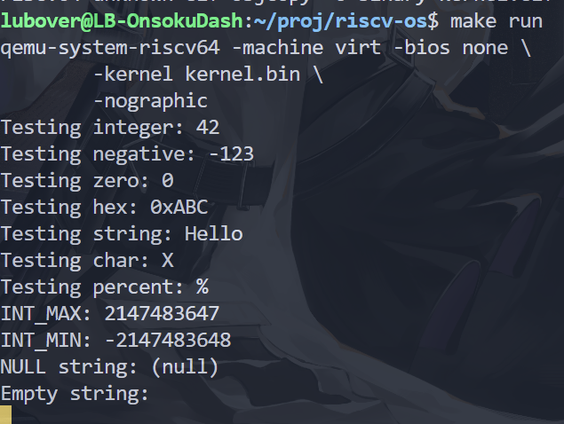

# 实验 2：内核 printf 与清屏功能实现

## 启动方式

```bash
>> make clean && make run
```

## 系统设计部分

### 系统架构部分

文件列表如下：

```text
.
├── LICENSE
├── Makefile
├── kernel
│   ├── console.c
│   ├── defs.h
│   ├── entry.S
│   ├── memlayout.h
│   ├── printf.c
│   ├── start.c
│   └── uart.c
├── kernel.bin
├── kernel.ld
├── main.c
└── scripts
    └── tree.bash
```

其中核心文件的作用如下：

- kernel/defs.h：提供给用户程序（如 `main` 函数）使用的接口定义
- kernel/printf.c：定义 `print_number` 和 `printf` 的实现（目前直接调用 console，不支持重定向）
- kernel/console.c：定义 `console_putc`，底层调用 UART 的 `uart_putc` 实现同步输出

### 与 xv6 对比分析

- `printf` 格式化控制符简化

由于实现基本的格式化输出功能无须支持复杂控制符，因此只举例了一些单字符控制符  
另外，不使用 if else，而是使用 switch 优化跳转逻辑

## 实验过程部分

### 实验步骤

#### 1）实现 console_putc

根据观察，printf 实际上大部分情况下使用的都是逐字符输出，因此先实现控制台的 putc 函数，它只是简单地调用 UART 的同步 putc 函数，如下：

```c
/// @brief 同步地调用 UART 发送一个字符到控制台
/// @param c 待发送字符
void console_putc( char c )
{
    uart_putc( c );
}
```

#### 2）实现 print_number

但是 printf 也不只有简单地直接单字符输出，其中调用的数字输出属于单次调用多字符输出的案例，因此先实现基础方法 print_number，代码如下：

```c
/// @brief 十六进制数字字符表，用于整数快速查表转字符串
static char HEX_DIGITS[] = "0123456789ABCDEF";

/// @brief 同步地调用 console_putc 输出一个整数，支持 2~16 进制
/// @param num 待输出的整数
/// @param base 该整数的输出进制（与内存中存储的进制无关）
static void print_number( long long num, int base, int is_signed )
{
    if ( base < 2 || base > 16 )
    {
        // 不是我支持的进制，直接返回
        return;
    }

    char buf[ 32 ];
    int idx = 0;

    unsigned long long n = num;

    if ( is_signed && ( is_signed = ( num < 0 ) ) )
    {
        // 如果是有符号数且为负数，则额外取其绝对值
        // 方便统一进行求模运算
        n = -num;
    }

    // 逐轮取模并转换为对应的字符，buf 中存储顺序相当于小端序
    // 简单的计算，为了防止 4KB 栈溢出，采用迭代
    do
    {
        buf[ idx++ ] = HEX_DIGITS[ n % base ];
    } while ( ( n /= base ) != 0 );

    if ( is_signed )
    {
        // 如果是有符号数且为负数，则在前面添加负号
        buf[ idx++ ] = '-';
    }

    // 从内存高位向低位输出字符
    while ( --idx >= 0 )
        console_putc( buf[ idx ] );
}
```

其实现逻辑如下：

1. 确定输入 num 是否是负数，参数中的 is_signed 仅作为参考使用；如果为负数，则直接去掉负号，防止取模运算不符合预期

1. 首先，通过模运算，逐次得到数字低位向数字高位，存储在缓冲区数组的从低位向高位

    ```text
    数组
    低 -------------> 高
    □□□□□□□□□□□□□□□□□□□
    数字
    低 -------------> 高
    （如：123在内存中为 3 | 2 | 1）
    ```

1. 根据负号决定是否添加 "-" 字符，再从数组高位向低位反向输出，得到人类可读形式的字符串形式数字

以上问题的根本原因在于，人类可读的数字高位在左，是形式上的大端序，而数组则是低位在左，是形式上的小端序，因此需要在构建缓冲区后反向输出，保证控制台先打印高位再打印低位

#### 3）实现 printf

完成 print_number 后，就没有特别的难度了，通过循环逐个解析 fmt 字符串中的控制符，并调用对应的方法打印即可

唯一需要注意的是，需要严格控制 va 对于栈上可变参数列表的读取长度，防止发生数据截断，获取到非法的数据

```c
/// @brief 单线程的格式化输出函数，支持 %d, %x, %c, %s 和 %%
/// @param fmt 待输出的格式化字符串
/// @param args... 具体的参数
void printf( const char* fmt, ... )
{
    va_list args;

    va_start( args, fmt );

    // 暂时不支持 %ll 等多位控制符
    int cx;
    char* s;

    for ( int i = 0; ( cx = fmt[ i ] & 0xFF ) != 0; i++ )
    {
        if ( cx != '%' )
        {
            console_putc( cx );
            continue;
        }

        // 处理 %d 控制符，额外先跳过 '%' 字符
        i++;

        cx = fmt[ i ] & 0xFF;

        switch ( cx )
        {
            case 'd':
                // 有符号十进制整数
                print_number( va_arg( args, int ), 10, 1 );
                break;

            case 'x':
                // 无符号十六进制整数
                print_number( va_arg( args, unsigned int ), 16, 0 );
                break;

            case 'c':
                // 字符
                console_putc( va_arg( args, unsigned int ) );
                break;

            case 's':
                // 字符串
                char* s = va_arg( args, char* );
                if ( s == 0 )
                    s = "(null)";
                for ( ; *s; s++ )
                    console_putc( *s );
                break;

            case '%':
                // 百分号本身
                console_putc( '%' );
                break;

            default:
                // 不支持的格式符，原样输出 % 和 cx
                console_putc( '%' );
                console_putc( cx );
                break;
        }
    }

    va_end( args );
}
```

其核心逻辑在于，只有在读取到 "%" 时，才跳出直接打印原始字符的操作，进入 switch 块根据控制符，获取并根据可变参数包中的对应数据进行特殊打印

#### 4）测试清屏等功能

ASCII 控制符码只是一串字节流，其清屏等功能实现有赖于终端，不属于 printf 的功能，因此直接将其放在 main 函数中进行测试，如下：

```c
#include "kernel/defs.h"

void clear_screen()
{
    printf( "\033[2J\033[H\033[K" );
}

void test_printf_basic()
{
    printf( "Testing integer: %d\n", 42 );
    printf( "Testing negative: %d\n", -123 );
    printf( "Testing zero: %d\n", 0 );
    printf( "Testing hex: 0x%x\n", 0xABC );
    printf( "Testing string: %s\n", "Hello" );
    printf( "Testing char: %c\n", 'X' );
    printf( "Testing percent: %%\n" );
}

void test_printf_edge_cases()
{
    printf( "INT_MAX: %d\n", 2147483647 );
    printf( "INT_MIN: %d\n", -2147483648 );
    printf( "NULL string: %s\n", ( char* ) 0 );
    printf( "Empty string: %s\n", "" );
}

int main()
{
    test_printf_basic();
    test_printf_edge_cases();

    clear_screen();

    return 0;
}
```

### 源码理解总结

本次实现 printf 确实是比较新奇的体验，也让我逐渐理解了我曾经听到的为什么说在性能热点路径上不要使用 format 来进行格式化（因为 % 控制符的特性，如果不想出现冗余扫描，就必须使用循环先逐字符处理，而不能直接将整个字符串数组拷贝给外设进行输出）

## 测试验证部分

编写 Makefile 编译运行，测试结果如下：

> 注：清屏会影响观察结果，因此略去


