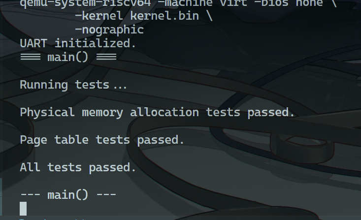
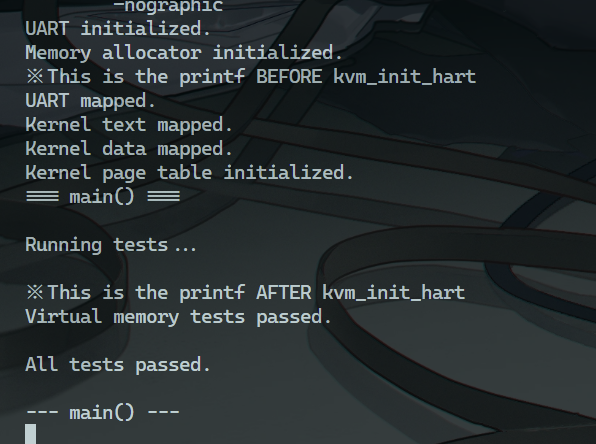

# 实验 3：页表与内存管理

## 启动方式

```bash
>> make clean && make run
```

## 系统设计部分

### 系统架构部分

文件列表如下：

```text
.
├── LICENSE
├── Makefile
├── kernel
│   ├── console.c
│   ├── defs.h
│   ├── entry.S
│   ├── kalloc.c
│   ├── memlayout.h
│   ├── printf.c
│   ├── start.c
│   ├── uart.c
│   └── vm.c
├── kernel.bin
├── kernel.elf
├── kernel.ld
├── main.c
├── reports
│   ├── img
│   │   ├── experiment_1_result_picture.png
│   │   ├── experiment_2_result_picture.png
│   │   ├── experiment_3-1_result_picture.png
│   │   └── experiment_3-2_result_picture.png
│   ├── report-0001.md
│   ├── report-0002.md
│   └── report-0003.md
└── scripts
    └── tree.bash
```

其中核心文件的作用如下：

- kalloc.c：实现物理内存的分配与回收
- vm.c：实现基于物理内存页表虚拟地址映射

### 与 xv6 对比分析

- 单线程处理

在 kalloc 中，由于没有并发要求，所以取消了对 kmem 的自旋锁保护。

- 类型加强

xv6 源码的风格过于狂野，也导致我一开始出现了严重的类型导致的错误，因此我对诸如 free_list、free_block，以及最重要的 pagetable 的类型进行了严格限制，而不是直接以 void* 统一一写了事

## 实验过程部分

### 实验步骤

#### 1）实现 kalloc.c

物理内存的分配，本质上就是将指定的地址分配给调用者，而地址本身就是一种元数据，因此直接采用 struct free_block* 这个指针值来巧妙地存储可用地址的值，并且可以很轻松地将其转换为链表使用：

```c
/// @brief free_list 指向空闲内存链表一个 entry 的首地址，大小始终为 4KB
struct free_block
{
    struct free_block* next;
};

/// @brief free_list 是内存分配器的元数据，包含一个空闲内存链表的头指针
struct free_list
{
    struct free_block* head;
};

/// @brief 内存分配器的全局实例
struct free_list kmem;
```

在将可用内存封装为链表后，可以很轻松地写出栈式的内存分配算法：

```c
// @brief free_page 将一页物理内存（以 pa 起始的 PAGE_SIZE 字节）回收到内存分配器中
/// @param pa 物理内存的起始地址
void free_page( addr pa )
{
    struct free_block* b;

    if ( ( ( unsigned long ) pa % PAGE_SIZE ) != 0
        || ( char* ) pa < end )
    {
        // 地址不是页对齐，或者地址小于内核结束位置
        // 则是非法地址，则直接 panic
        panic( "free_page" );
    }

    // 将该页内存填充为 1，以帮助检测野指针
    memset( pa, 1, PAGE_SIZE );

    // 将该页内存回收到空闲链表中
    // 此处使用头插，所以最晚释放的页最先被重新分配
    // 另外，这里直接略去了多线程的锁控制
    b = ( struct free_block* ) pa;

    b->next = kmem.head;

    kmem.head = b;
}

/// @brief 将从 pa_start 到 pa_end 范围内的物理内存全部按页回收到内存分配器中
/// @param pa_start 
/// @param pa_end 
void free_range( addr pa_start, addr pa_end )
{
    char* p;
    p = ( char* ) ( ( ( unsigned long ) pa_start + 0xFFF ) & ~0xFFF );

    for ( ; p + PAGE_SIZE <= ( char* ) pa_end; p += PAGE_SIZE )
        free_page( p );
}

/// @brief alloc_page 从空闲链表的表头分配一页内存，返回该页内存的起始地址
/// @return 返回分配的内存页起始地址，失败则返回 NULL
addr alloc_page()
{
    struct free_block* b;

    if ( ( b = kmem.head ) == 0 )
    {
        printf( "alloc_page: out of memory\n" );

        return 0;
    }

    // 如果还有空闲内存，则为 kmem 后移一个 entry
    kmem.head = b->next;

    // 将该页内存置 5，防止有残留数据和野指针
    memset( b, 5, PAGE_SIZE );


    return ( addr ) b;
}
```

最后，再封装一个用于初始化内核物理内存分配器的 init 函数，它将 end 到 PHYSTOP 的动态空间加入空闲列表：

```c
/// @brief kmem_init 初始化内存分配器，回收内核结束位置到物理内存上限的所有内存
/// @brief 只是简单地调用了 free_range
void kmem_init()
{
    free_range( end, ( addr ) PHYSTOP );
}
```

#### 2）实现 vm.c

- 定义与宏

要实现页表管理虚拟内存，首先要确定实现的协议，我使用 xv6 的 Sv39 协议标度虚拟内存地址，定义如下：

```c
/// @brief pgtbl_entry 表示页表项
typedef u64 pgtbl_entry;
/// @brief pgtbl_addr 表示页表的起始地址
typedef pgtbl_entry* pgtbl_addr;

#define PAGE_SIZE 4096

#define PAGE_ROUNDUP(a)  (((a)+PAGE_SIZE-1) & ~(PAGE_SIZE-1))
#define PAGE_ROUNDDOWN(a) (((a)) & ~(PAGE_SIZE-1))

#define PTE_V (1L << 0) // valid
#define PTE_R (1L << 1)
#define PTE_W (1L << 2)
#define PTE_X (1L << 3)
#define PTE_U (1L << 4) // user can access

#define PA2PTE(pa) ((((u64)pa) >> 12) << 10)
#define PTE2PA(pte) (((pte) >> 10) << 12)
#define PTE_FLAGS(pte) ((pte) & 0x3FF)
#define PXMASK          0x1FF // 9 bits
#define PXSHIFT(level)  (12+(9*(level)))
#define PX(level, va) ((((u64) (va)) >> PXSHIFT(level)) & PXMASK)

#define MAXVA (1L << (9 + 9 + 9 + 12 - 1))

#define SATP_SV39 (8L << 60)
#define MAKE_SATP(pgtbl) (SATP_SV39 | (((u64)pgtbl) >> 12))
```

需要注意的是，与 xv6 源码不同，我此处将所谓的 pagetable_t 的类型定义为了显式的 pgtbl_entry*（也就是 u64*，指向 8 字节的指针），这是因为如果使用 void*，将会在后续进行页表寻址时出现严重的 bug。

- 实现 walk

为了实现从 va 到 pa 的转换，必须实现一种寻找机制，而 walk 就是类似于 map 中递归查找的操作。  
其实现了通过位操作将 va 中的序号提取为页表索引，进而进行递归搜索多级页表的操作，如下：

```c
/// @brief 遍历页表 pg_tbl，找到虚拟地址 va 对应的页表项
/// @brief 如果中间的页表不存在且 alloc 非 0，则分配新的页表
/// @param pgtbl 出发页表
/// @param va 要查找页表项的虚拟地址
/// @param alloc 是否允许分配新的页表
/// @return 找到的页表项指针，失败则返回 0
pgtbl_entry* walk( pgtbl_addr pgtbl, addr va, int alloc )
{
    if ( va >= ( addr ) MAXVA )
    {
        // 虚拟地址超过最大值，非法
        panic( "walk" );
    }

    //printf( "walk va %x, alloc: %d\n", va, alloc );

    // 最多遍历两级页表
    for ( int level = 2; level > 0; level-- )
    {
        //printf( "walk level %d, pgtbl addr: %x\n", level, pgtbl );

        pgtbl_entry* p_pte = &pgtbl[ PX( level, va ) ];

        //printf( "PTE addr: %x\n", p_pte );

        if ( *p_pte & PTE_V )
        {
            // printf( "walk pte valid: %x, va: %x, level: %d, pte2pa: %x\n",
            //     *p_pte, va, level, PTE2PA( *p_pte ) );

            // PTE_V 位为 1，表示该页表项有效，继续向下查找
            pgtbl = ( pgtbl_addr ) PTE2PA( *p_pte );

            continue;
        }

        //printf( "PTE value invalid: %x\n", *p_pte );

        // PTE_V 位为 0，表示该页表项无效，尝试分配
        if ( ( alloc == 0 ) || ( pgtbl = ( pgtbl_addr ) alloc_page() ) == 0 )
        {
            printf( "walk alloc failed for alloc: %d, pgtbl: %x, level: %d\n",
                alloc, pgtbl, level );

            // 不允许分配新页表，或者分配失败，返回 0
            return 0;
        }

        // printf( "walk alloc new pgtbl at: %x, level: %d, page_cnt = %d\n",
        //     pgtbl, level, ++pagetbl_cnt );

        // 分配到的新页表的内存必须清零
        memset( pgtbl, 0, PAGE_SIZE );

        // 将新分配的页内存的物理地址写入该页表项，并设置 PTE_V 位为 1
        *p_pte = ( PA2PTE( pgtbl ) | PTE_V );
    }

    return &pgtbl[ PX( 0, va ) ];
}
```

实现了 walk 之后，实现映射函数就非常简单了，只需要控制好 alloc 控制位，即可实现 find 和 insert，如下：

```c
/// @brief 将 va 地址开始的 size 大小的虚拟地址映射到物理地址 pa 开始 size 大小的内存上
/// @param pgtbl 要记录的基础页表（应该是根页表）
/// @param va 虚拟空间的起始地址
/// @param size 要映射的大小
/// @param pa 物理空间的起始地址
/// @param perm 页表项的权限
/// @return 错误码，0 表示成功，-1 表示失败
int map_pages( pgtbl_addr pgtbl, addr va, u64 size, addr pa, int perm )
{
    if ( ( ( u64 ) va % PAGE_SIZE ) != 0 )
    {
        // va 必须是页对齐的
        panic( "mappages: va not aligned" );
    }

    if ( size == 0 )
    {
        // 映射大小不能为 0
        panic( "mappages: size is 0" );
    }

    if ( ( ( u64 ) size % PAGE_SIZE ) != 0 )
    {
        // size 必须是页对齐的
        panic( "mappages: size not aligned" );
    }

    //printf( "map_pages va %x, size %d, pa %x, perm %x\n", va, size, pa, perm );

    addr curr_va = va;
    addr last_va = va + size - PAGE_SIZE;
    addr curr_pa = pa;

    //printf( "map_pages loop variables: curr_va %x, last_va %x, curr_pa %x\n", curr_va, last_va, curr_pa );

    pgtbl_entry* p_new_pte;

    // 对给定的范围中的每一页都进行映射
    // 本质上是在页表中找到一个地方，放置一个 va -> pa 的映射
    // 使用 do while，表示至少进行一次映射
    do
    {
        //printf( "map_pages loop for curr_va %x, curr_pa %x\n", curr_va, curr_pa );

        // 在指定页表上进行遍历，尝试分配一个新的 PTE
        if ( ( p_new_pte = walk( pgtbl, curr_va, 1 ) ) == 0 )
        {
            printf( "map_pages: walk failed for va %x\n", curr_va );

            return -1;
        }

        if ( *p_new_pte & PTE_V )
        {
            // 映射到了已占用的 page，panic
            panic( "mappages: remap" );
        }

        // printf( "newly mapped va %x\n", curr_va );

        // 将物理地址 pa 和权限 perm 写入该页表项，并设置 PTE_V 位为 1
        *p_new_pte = PA2PTE( curr_pa ) | perm | PTE_V;

        if ( curr_va == last_va )
        {
            break;
        }

        curr_va += PAGE_SIZE;
        curr_pa += PAGE_SIZE;

    } while ( 1 );

    return 0;
}

/// @brief 将内核的虚拟地址 va 映射到物理地址 pa 上，大小为 size，权限为 perm
/// @param pgtbl 根页表
/// @param va 虚拟地址
/// @param pa 物理地址
/// @param size 映射大小
/// @param perm 权限
void kvm_map( pgtbl_addr pgtbl, addr va, addr pa, u64 size, int perm )
{
    if ( map_pages( pgtbl, va, size, pa, perm ) != 0 )
    {
        panic( "kvm_map" );
    }
}
```

最后实现简单的 init 接口函数：

```c
/// @brief 激活当前 hart 的内核页表
void kvm_init_hart( void )
{
    // 使用屏障指令确保页表修改生效，理论上在单核情况下不需要
    sfence_vma();

    write_satp( MAKE_SATP( kernel_pgtbl ) );

    sfence_vma();
}

pgtbl_addr kvm_make( void )
{
    // 为根页表分配一个物理页
    pgtbl_addr kpgtbl = ( pgtbl_addr ) alloc_page();

    memset( kpgtbl, 0, PAGE_SIZE );

    // 初始化 UART，可读写
    kvm_map(
        kpgtbl, ( addr ) UART0, ( addr ) UART0,
        PAGE_SIZE,
        PTE_R | PTE_W
    );

    //printf( "UART mapped.\n" );

    // 初始化 kernel text 段，只读、可执行
    kvm_map(
        kpgtbl, ( addr ) KERNBASE, ( addr ) KERNBASE,
        ( u64 ) etext - KERNBASE,
        PTE_R | PTE_X
    );

    //printf( "Kernel text mapped.\n" );

    // 初始化 kernel data 段，可读写
    // NOTICE: 恒等映射 PHTSTOP - etext，则物理内存不够
    // 因此，修改 kmem_init 使其匹配虚拟内存的大小
    kvm_map(
        kpgtbl, ( addr ) etext, ( addr ) etext,
        PHYSTOP - ( u64 ) etext,
        PTE_R | PTE_W
    );

    //printf( "Kernel data mapped.\n" );

    return kpgtbl;
}

void kvm_init( void )
{
    kernel_pgtbl = kvm_make();

    kvm_init_hart();
}
```

### 源码理解总结

这一次的实现难度明显大了不少，但是最核心问题还是在于页表虚拟内存转换时的诸多细节，比如：

- map 映射过程中，循环应至少执行一次，防止 curr_va == curr_pa 无法映射
- pagetable 作为数组，绝对不可以是 1 字节对齐的 void*，否则在数组寻址时会获取到完全意料之外的无效 PTE，进而导致检查 PTE_V 无效，最终使得所有程序无止境地分配多余页表

本次实现确实使得我对页表机制的理解大幅提升，且让我更进一步了解了 C 这门语言的坑点。只能赞美强类型语言了。

## 测试验证部分

编写 Makefile 编译运行，测试结果如下：

（第一部分）



（第二部分）



需要注意的是，由于开启页表与不开启页表的测试会使用两个页表，因此我的测试是分为两部分进行的，第一部分测试物理内存分配与页表的插入和读取，其 start 函数与 main 函数如下：

```c
/// start.c
#include "defs.h"

extern char _bss_start[], _bss_end[];

void main();

// stack0 的值（地址）由链接器自动确定，其定义为数组的根本原因只是为了
// 在 .bss 段中分配一份足够大的空间作为栈空间而已
__attribute__( ( aligned( 16 ) ) ) char stack0[ 4096 ];

/// @brief 内核入口函数，完成各种组件初始化，然后调用 main
void start()
{
    // 清零 .bss 段
    for ( char* p = _bss_start; p < _bss_end; p++ )
    {
        *p = 0;
    }

    // 初始化 UART
    uart_init();

    printf( "UART initialized.\n" );

    // // 初始化内存分配器
    // kmem_init();

    // printf( "Memory allocator initialized.\n" );

    // // 初始化内核页表
    // kvm_init();

    // printf( "Kernel page table initialized.\n" );

    main();
}

/// main.c
#include "kernel/defs.h"

void test_physical_memory( void )
{
    kmem_init();

    // 测试基本分配和释放
    void* page1 = alloc_page();
    void* page2 = alloc_page();
    assert( page1 != 0 && page2 != 0 );
    assert( page1 != page2 );
    assert( ( ( u64 ) page1 & 0xFFF ) == 0 ); // 页对齐检查

    // 测试数据写入
    *( int* ) page1 = 0x12345678;
    assert( *( int* ) page1 == 0x12345678 );

    // 测试释放和重新分配
    free_page( page1 );
    void* page3 = alloc_page();
    // page3可能等于page1（取决于分配策略）
    assert( page3 == page1 );

    free_page( page2 );
    free_page( page3 );

    printf( "Physical memory allocation tests passed.\n" );
}

extern pgtbl_entry* walk( pgtbl_addr pgtbl, addr va, int alloc );
extern int map_pages( pgtbl_addr pgtbl, addr va, u64 size, addr pa, int perm );
extern pgtbl_addr kernel_pgtbl;

void test_pagetable( void )
{
    // 注意：此时没有启用 kvm init
    kernel_pgtbl = ( pgtbl_addr ) alloc_page();

    memset( kernel_pgtbl, 0, PAGE_SIZE );

    // 测试基本映射
    addr va = 0x80088000;
    addr pa = alloc_page();

    assert( map_pages( kernel_pgtbl, va, PAGE_SIZE, pa, PTE_R | PTE_W ) == 0 );

    // 测试地址转换
    pgtbl_entry* pte = walk( kernel_pgtbl, va, 0 );

    assert( pte != 0 && ( *pte & PTE_V ) );

    // 测试权限位
    assert( *pte & PTE_R );
    assert( *pte & PTE_W );
    assert( !( *pte & PTE_X ) );

    printf( "Page table tests passed.\n" );
}

int main()
{
    printf( "=== main() ===\n\n" );

    printf( "Running tests...\n\n" );

    test_physical_memory();

    printf( "\n" );

    test_pagetable();

    printf( "\n" );

    printf( "All tests passed.\n\n" );

    printf( "--- main() ---\n" );

    return 0;
}
```

而第二部分测试则单独设置 SATP 寄存器，使用虚拟化页表：

```c
/// start.c
#include "defs.h"

extern char _bss_start[], _bss_end[];

void main();

// stack0 的值（地址）由链接器自动确定，其定义为数组的根本原因只是为了
// 在 .bss 段中分配一份足够大的空间作为栈空间而已
__attribute__( ( aligned( 16 ) ) ) char stack0[ 4096 ];

/// @brief 内核入口函数，完成各种组件初始化，然后调用 main
void start()
{
    // 清零 .bss 段
    for ( char* p = _bss_start; p < _bss_end; p++ )
    {
        *p = 0;
    }

    // 初始化 UART
    uart_init();

    printf( "UART initialized.\n" );

    // 初始化内存分配器
    kmem_init();

    printf( "Memory allocator initialized.\n" );

    printf( "※ This is the printf BEFORE kvm_init_hart\n" );

    // 初始化内核页表
    kvm_init();

    printf( "Kernel page table initialized.\n" );

    main();
}

#include "kernel/defs.h"

// void test_physical_memory( void )
// {
//     kmem_init();

//     // 测试基本分配和释放
//     void* page1 = alloc_page();
//     void* page2 = alloc_page();
//     assert( page1 != 0 && page2 != 0 );
//     assert( page1 != page2 );
//     assert( ( ( u64 ) page1 & 0xFFF ) == 0 ); // 页对齐检查

//     // 测试数据写入
//     *( int* ) page1 = 0x12345678;
//     assert( *( int* ) page1 == 0x12345678 );

//     // 测试释放和重新分配
//     free_page( page1 );
//     void* page3 = alloc_page();
//     // page3可能等于page1（取决于分配策略）
//     assert( page3 == page1 );

//     free_page( page2 );
//     free_page( page3 );

//     printf( "Physical memory allocation tests passed.\n" );
// }

// extern pgtbl_entry* walk( pgtbl_addr pgtbl, addr va, int alloc );
// extern int map_pages( pgtbl_addr pgtbl, addr va, u64 size, addr pa, int perm );
// extern pgtbl_addr kernel_pgtbl;

// void test_pagetable( void )
// {
//     // 注意：此时没有启用 kvm init
//     kernel_pgtbl = ( pgtbl_addr ) alloc_page();

//     memset( kernel_pgtbl, 0, PAGE_SIZE );

//     // 测试基本映射
//     addr va = 0x80088000;
//     addr pa = alloc_page();

//     assert( map_pages( kernel_pgtbl, va, PAGE_SIZE, pa, PTE_R | PTE_W ) == 0 );

//     // 测试地址转换
//     pgtbl_entry* pte = walk( kernel_pgtbl, va, 0 );

//     assert( pte != 0 && ( *pte & PTE_V ) );

//     // 测试权限位
//     assert( *pte & PTE_R );
//     assert( *pte & PTE_W );
//     assert( !( *pte & PTE_X ) );

//     printf( "Page table tests passed.\n" );
// }

void test_virtual_memory( void )
{
    printf( "※ This is the printf AFTER kvm_init_hart\n" );

    printf( "Virtual memory tests passed.\n\n" );
}

int main()
{
    printf( "=== main() ===\n\n" );

    printf( "Running tests...\n\n" );

    test_virtual_memory();

    printf( "All tests passed.\n\n" );

    printf( "--- main() ---\n" );

    return 0;
}
```
