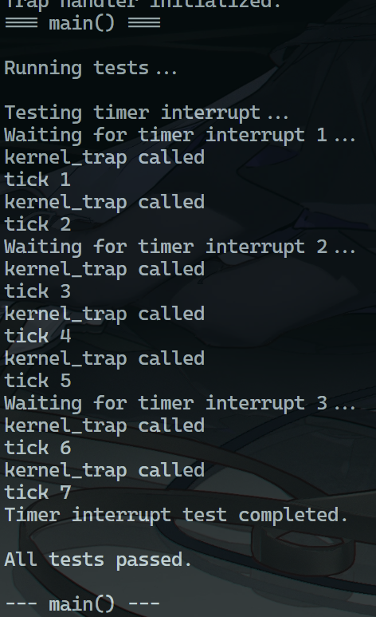
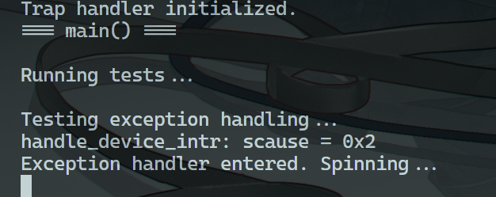

# 实验 4：中断处理与时钟管理

## 启动方式

```bash
>> make clean && make run
```

## 系统设计部分

### 系统架构部分

文件列表如下：

```text
.
├── LICENSE
├── Makefile
├── kernel
│   ├── console.c
│   ├── defs.h
│   ├── entry.S
│   ├── kalloc.c
│   ├── kernelvec.S
│   ├── memlayout.h
│   ├── printf.c
│   ├── riscv.c
│   ├── riscv.h
│   ├── start.c
│   ├── trap.c
│   ├── uart.c
│   └── vm.c
├── kernel.bin
├── kernel.elf
├── kernel.ld
├── main.c
├── reports
│   ├── img
│   │   ├── experiment_1_result_picture.png
│   │   ├── experiment_2_result_picture.png
│   │   ├── experiment_3-1_result_picture.png
│   │   ├── experiment_3-2_result_picture.png
│   │   ├── experiment_4-1_result_picture.png
│   │   └── experiment_4-2_result_picture.png
│   ├── report-0001.md
│   ├── report-0002.md
│   ├── report-0003.md
│   └── report-0004.md
├── scripts
│   └── tree.bash
└── test.md
```

其中核心文件的作用如下：

- riscv.h/riscv.c：封装 RISC-V 寄存器读写操作函数
- start.c：重构，添加针对各种权限模式的操作，以及启动 main 之前的初始化
- kernelvec.S：中断处理程序的入口
- trap.c：中断处理程序的核心逻辑

### 与 xv6 对比分析

- 简化 trap handler

由于现阶段核心是测试 interupt 和 exception 的流程，因此只保留了测试用的打表。

- 简化现场恢复

由于现在是不存在多核、进程调度的环境，因此在 kernel_trap 函数可以适当简化几个现场寄存器的恢复。

## 实验过程部分

### 实验步骤

#### 1）修改 start.c

本次实验最难的部分就是搞清楚各种权限等级以及相互之间的交互关系。

因此先处理模式切换的部分：

由于一开始 start 函数是启动在 M 模式下的，因此需要一个机制切换到 S 模式。xv6 使用的是将 MPP 设置为 S 模式，然后利用 mret 跳回到 S 模式来完成。它实际是一个包含权限切换的 jump 指令，因此还需要另外添加一个 ra。

代码如下：

```c
void perm_init() {
    // 设置 mstatus 寄存器的 MPP 位为 S 模式
    // 用于在发生中断、异常时切换到 S 模式进行处理
    u64 mstatus = read_mstatus();

    mstatus = ( mstatus & ~MSTATUS_MPP_MASK ) | MSTATUS_MPP_S;

    write_mstatus( mstatus );

    // 设置 mret 地址为 call_main 函数
    write_mepc( ( u64 ) call_main );
}

/// @brief 内核入口函数，完成各种组件初始化
void start() {
    // 清零 .bss 段
    cleanup_bss();

    // 初始化委托中断和异常
    intr_init();

    // 禁止页表转换
    write_satp( 0 );

    // 应用物理内存保护
    enable_physical_protection();

    // 初始化定时器
    timer_init();

    // 初始化权限关系
    perm_init();

    // 这里应该会以 S 模式（MPP设定）进入 call_main 函数
    asm volatile( "mret" );
}
```

仅依靠 perm_init 和 mret 联动只解决了如何切换到 S 模式的问题。

由于 S 模式初始是几乎没有任何权限的，要使得处于 S 模式的 OS 能够真正处理中断，还需要将中断处理向量表（实际上 xv6 似乎不是一个表，而只是一个操作寄存器的处理函数）注册到 M 模式中，并且让 M 模式将所有中断委托给 S 模式处理。

因此可以补充 start 函数中的其他函数实现如下：

```c
void intr_init() {
    // 将所有中断和异常都委托给 S 模式处理
    write_medeleg( 0xffff );
    write_mideleg( 0xffff );

    // 使能 S 模式下的外部中断和定时器中断
    write_sie( read_sie() | SIE_SEIE | SIE_STIE );

    // 开启 S 模式的总中断开关
    write_sstatus( read_sstatus() | SSTATUS_SIE );
}

void enable_physical_protection() {
    // 赋予 S 模式所有内存空间的操作 RWX 权限
    write_pmpaddr0( 0x3fffffffffffffull );
    write_pmpcfg0( 0xf );
}

void timer_init() {
    // 使能机器模式下的定时器中断
    write_mie( read_mie() | MIE_STIE );

    // 使能机器模式下的计数器访问
    // 1L << 63 代表允许在 S 模式下访问机器模式的计数器寄存器
    write_menvcfg( read_menvcfg() | ( 1L << 63 ) );

    // 使能计数器寄存器的访问
    // 这里允许 S 模式下访问 mcounteren 的第 1 位（代表 time 寄存器）
    write_mcounteren( read_mcounteren() | 1L << 1 );

    // 设置下一个时钟中断时间（大约 0.1 秒后？）
    write_stimecmp( read_time() + 1000000 );
}
```

其核心函数是 intr_init 函数，它将本该自动由 M 模式处理的中断全部下放到 S 模式处理，也就是代表着 stvec 寄存器将被在中断时读取并执行。

而 enable_physical_protection 则是保证 S 模式获得内存的访问权，否则无法进行 kmem 等的初始化。timer_init 也是出于同样的目的，是开启定时器中断，并赋予 S 模式读取的权力。

处理了所有 S 模式的权限并且可以跳转到 S 模式后，就可以正式开始进行 UART 等涉及内存的初始化了。这一部分不涉及 M 模式寄存器的操作不适合放在 start 函数中，因此正好放在 call_main 函数（以 S 模式执行）中进行。

代码如下：

```c
void call_main() {
    // 初始化 UART
    uart_init();

    printf( "UART initialized.\n" );

    // 初始化内存分配器
    kmem_init();

    printf( "Memory allocator initialized.\n" );

    // 初始化内核页表
    kvm_init();

    printf( "Kernel page table initialized.\n" );

    // 初始化 trap 处理程序
    trap_init();

    printf( "Trap handler initialized.\n" );

    // 最后调用 main
    if ( main() != 0 ) {
        panic( "main() returned with error\n" );
    }

    // 正常情况下不应该返回，因此自旋
    while ( 1 );
}
```

#### 2）实现 kernelvec.S

使用 .S 汇编编写代码与 C 的核心区别在于可以简单地操作寄存器。此处编写 kernelvec.S 的核心原因是需要在发生中断跳转过来时，保存所有必要现场到 trap frame 中，以保证中断可以正常恢复到调用者。

因此代码如下：

```S
.globl kernelvec
.globl s_trap_handler_c
.align 4

kernelvec:
    # 预留 trap frame 空间（从 248 字节对齐到 256 字节）
    addi sp, sp, -256

    # 除了 x0 (zero) 和 x2 (sp) 外，保存所有通用寄存器到 Trap Frame
    sd x1, 0(sp)
    sd x3, 8(sp)
    sd x4, 16(sp)
    sd x5, 24(sp)
    sd x6, 32(sp)
    sd x7, 40(sp)
    sd x8, 48(sp)
    sd x9, 56(sp)
    sd x10, 64(sp)
    sd x11, 72(sp)
    sd x12, 80(sp)
    sd x13, 88(sp)
    sd x14, 96(sp)
    sd x15, 104(sp)
    sd x16, 112(sp)
    sd x17, 120(sp)
    sd x18, 128(sp)
    sd x19, 136(sp)
    sd x20, 144(sp)
    sd x21, 152(sp)
    sd x22, 160(sp)
    sd x23, 168(sp)
    sd x24, 176(sp)
    sd x25, 184(sp)
    sd x26, 192(sp)
    sd x27, 200(sp)
    sd x28, 208(sp)
    sd x29, 216(sp)
    sd x30, 224(sp)
    sd x31, 232(sp)

    mv a0, sp

    # 调用 C 编写的 trap 处理函数
    call kernel_trap

    # 恢复通用寄存器
    ld x1, 0(sp)
    ld x3, 8(sp)
    ld x4, 16(sp)
    ld x5, 24(sp)
    ld x6, 32(sp)
    ld x7, 40(sp)
    ld x8, 48(sp)
    ld x9, 56(sp)
    ld x10, 64(sp)
    ld x11, 72(sp)
    ld x12, 80(sp)
    ld x13, 88(sp)
    ld x14, 96(sp)
    ld x15, 104(sp)
    ld x16, 112(sp)
    ld x17, 120(sp)
    ld x18, 128(sp)
    ld x19, 136(sp)
    ld x20, 144(sp)
    ld x21, 152(sp)
    ld x22, 160(sp)
    ld x23, 168(sp)
    ld x24, 176(sp)
    ld x25, 184(sp)
    ld x26, 192(sp)
    ld x27, 200(sp)
    ld x28, 208(sp)
    ld x29, 216(sp)
    ld x30, 224(sp)
    ld x31, 232(sp)

    # 恢复 sp
    addi sp, sp, 256

    # S 模式中断返回调用者
    sret
```

#### 3）实现 trap.c

在实现了 kernelvec 后，就需要实现真正的 kernel_trap 处理函数。这部分其实逻辑相对简单，核心思路是根据 scause 派发到不同的处理函数进行处理。

首先编写 kernel_trap 的整体逻辑：

```c
/// @brief 内核态的 trap 处理函数
void kernel_trap() {
    // printf( "kernel_trap called\n" );

    u64 scause = read_scause();
    u64 sepc = read_sepc();
    u64 sstatus = read_sstatus();

    if ( ( sstatus & SSTATUS_SPP ) == 0 ) {
        // 并非由 supervisor 模式进入 kernel trap
        panic( "kernel_trap: not from supervisor mode" );
    }

    if ( is_interupt_on() ) {
        // handle trap 时不应该开启中断
        panic( "kernel_trap: interrupt enabled" );
    }

    // 进行派发的核心部分
    if ( handle_device_intr() == -1 ) {
        printf( "scause %x\n", scause );
        printf( "sepc %x\n", sepc );
        panic( "kernel_trap: unexpected scause" );
    }

    // 虽然目前因为没有进程调度，所以没有 yield，不会导致其他 intr 产生
    // 但是仍然写上还原现场的代码
    // write_spec( sepc );
    // write_sstatus( sstatus );
}
```

然后是根据 scause 进行 switch 的 handle_device_intr 函数（对无效的返回码进行了修改，从 0 改为了 -1：

```c
int ticks = 0;

/// @brief 处理时钟中断
void handle_clock_intr() {
    ticks++;

    // printf( "tick %d\n", ticks );

    // 记录下一个时钟中断时间（大约 0.1 秒后？）
    write_stimecmp( read_time() + 1000000 );
}

/// @brief 检查是否是外部中断或者是软件中断，并且调用相应的处理函数
/// @return 2：时钟中断；1：外部中断；-1：无效
int handle_device_intr( u64 scause ) {
    // int msb = ( scause >> 63 ) & 1;

    switch ( scause ) {
        case 0x8000000000000005L:
            handle_clock_intr();
            return 2;

        case 0x2L:
            // TODO：这里是对 exception 捕获的异常处理测试代码
            printf( "handle_device_intr: scause = 0x%x\n", scause );
            write_sepc( ( u64 ) spin );
            return 1;

        default:
            return -1;
    }
}
```

最后添加简单的 init 函数，将 kernelvec 注册到 S 模式中断处理向量上：

```c
/// @brief 定义在 kernelvec.S 中的内核 trap 入口函数
extern void kernelvec();

/// @brief 启用 trap 处理程序
void tarp_init_hart() {
    // 设置内核的 trap 入口地址
    write_stvec( ( u64 ) kernelvec );
}

void trap_init() {
    tarp_init_hart();
}
```

### 源码理解总结

这一次的实验几乎已经与正常的 xv6 实现没有区别了，在涉及权限管理的部分，已经必须严格按照 RISC-V 设定的 SBI 进行设定。

难度上应该是比上一节的页表更加困难，因为 PPT 几乎没有提供对最困难的 “权限” 部分的讲解，甚至没有怎么提到这个部分。因此不得不自己进行摸索和查阅资料。

在解决了 kernelvec 现场保存和 start 函数的权限切换后，基本没有太大的难度。

## 测试验证部分

编写 Makefile 编译运行，测试结果如下：

（第一部分）



（第二部分）



同样需要注意的是，由于测试的异常基本都是现阶段无法恢复的，所以异常测试的代码不得不与时钟中断的测试分开进行。

其中测试时钟中断的 main.c 文件如下：

```c
void test_timer_interupt() {
    printf( "Testing timer interrupt...\n" );

    // 等待几个时钟中断
    for ( int i = 0; i < 3; i++ ) {
        printf( "Waiting for timer interrupt %d...\n", i + 1 );

        // 空循环，等待中断发生
        for ( volatile int j = 0; j < 100000000; j++ );
    }

    printf( "Timer interrupt test completed.\n\n" );
}

int main() {
    printf( "=== main() ===\n\n" );

    printf( "Running tests...\n\n" );

    test_timer_interupt();

    printf( "All tests passed.\n\n" );

    printf( "--- main() ---\n" );

    return 0;
}
```

而第二部分测试异常需要跳出到一个自旋函数处，否则会导致内核退出的非法地址跳转异常（甚至比我测试非法命令异常都要早出现……）：

```c
// trap.c
/// @brief 检查是否是外部中断或者是软件中断，并且调用相应的处理函数
/// @return 2：时钟中断；1：外部中断；-1：无效
int handle_device_intr( u64 scause ) {
    // int msb = ( scause >> 63 ) & 1;

    switch ( scause ) {
        case 0x8000000000000005L:
            handle_clock_intr();
            return 2;

        case 0x2L:
            // TODO
            printf( "handle_device_intr: scause = 0x%x\n", scause );
            write_sepc( ( u64 ) spin );
            return 1;

        default:
            return -1;
    }
}

// main.c
void test_exception() {
    printf( "Testing exception handling...\n" );

    // 故意触发一个非法指令异常
    asm volatile( ".word 0xFFFFFFFF" );

    // 这行代码不应该被执行到
    printf( "Exception test failed\n" );
}

/// @brief 用于防止程序退出的自旋函数
void spin() {
    printf( "Exception handler entered. Spinning...\n" );
    while ( 1 );
}

int main() {
    printf( "=== main() ===\n\n" );

    printf( "Running tests...\n\n" );

    test_exception();

    printf( "All tests passed.\n\n" );

    printf( "--- main() ---\n" );

    return 0;
}

```
