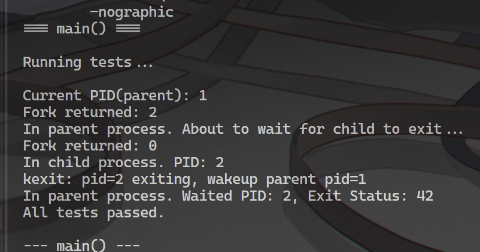

# 实验 5：进程管理与调度 & 实验 6：系统调用

## 启动方式

注意，由于添加了模拟的用户态程序，所以本次实验的启动需要使用 all 来构建。

```bash
>> make clean && make all && make run
```

## 系统设计部分

### 系统架构部分

文件列表如下：

```text
.
├── LICENSE
├── Makefile
├── kernel
│   ├── console.c
│   ├── defs.h
│   ├── entry.S
│   ├── file.c
│   ├── file.h
│   ├── kalloc.c
│   ├── kernelvec.S
│   ├── kexec.c
│   ├── memlayout.h
│   ├── printf.c
│   ├── proc.c
│   ├── proc.h
│   ├── riscv.c
│   ├── riscv.h
│   ├── start.c
│   ├── swtch.S
│   ├── syscall.c
│   ├── syscall.h
│   ├── trampoline.S
│   ├── trap.c
│   ├── uart.c
│   ├── userprog.c
│   ├── userprog.h
│   ├── userprog_data.h
│   └── vm.c
├── kernel.bin
├── kernel.elf
├── kernel.ld
├── main.c
├── reports
│   ├── img
│   │   ├── experiment_1_result_picture.png
│   │   ├── experiment_2_result_picture.png
│   │   ├── experiment_3-1_result_picture.png
│   │   ├── experiment_3-2_result_picture.png
│   │   ├── experiment_4-1_result_picture.png
│   │   └── experiment_4-2_result_picture.png
│   ├── report-0001.md
│   ├── report-0002.md
│   ├── report-0003.md
│   ├── report-0004.md
│   └── report-0005-6.md
├── scripts
│   ├── bin2c.sh
│   └── tree.bash
├── test.md
├── user
│   ├── types.h
│   ├── usrsyscall.c
│   └── usrsyscall.h
├── user_main.bin
└── user_main.elf
```

其中核心文件的作用如下：

- kexec.c：简化的 kexec 安装函数实现。从内核的 rodata 部分读取编译好的 user program 代码加载到用户页表中，并替代原先的 init 进程。
- swtch.S：内核态进程上下文切换的实现。
- trampoline.S：内核态与用户态切换跳板函数实现。
- trap.c：用户态 trap，尤其是 syscall 部分的实现。

此外，大改了如下文件：

- vm.c：提供了针对 uvm，以及 uvm 以及 kvm 交互的各类函数。
- trap.c：提供了内核态下，对 page fault、time interuption 等的处理函数。

### 与 xv6 对比分析

本次实验与 xv6 有极大差别，主要体现在以下几点：

- uvm 相关的管理方式，因为我缺少 kexec 和对应的 fs 来启动一个真正的 user elf image，因此我的 user stack 的分配和页表映射是与 text 段等部分分离映射的。所以不使用 mem_size 来进行 copy 和 unmap。
- 在用户态可使用的系统调用上，由于我没有额外定制一份用户态的 printf 等函数，因此将 print 直接作为系统调用封装，让用户态程序使用系统调用打印字符串。
- 将用户态相关内存排布信息添加到了 memlayout.h 中，以便实现在涉及到用户态页表操作（尤其是 user stack）时，可以直接获取到统一定义的值。
- 由于是单线程运行的内核，因此将与 cpu 相关的实现删去，代之以全局变量存储相关状态。

## 实验过程部分

本次实验由于是同时实现了两部分的内容，涉及面极广，因此不再将所有代码直接给出。  
重点将会转移到介绍思路，然后按照思路发散的过程，给出重点函数与代码。

### 实验步骤

#### 1）上下文相关定义

进程调度的核心是状态保存与恢复，因此一定需要一些空间来存储这些需要恢复的状态。用户态协程的实现通常有基于栈的 stackful coroutine（入Go 的 goroutine）和基于状态机的 stackless coroutine（如 Rust 的 future）。

而进程，或者说 **执行器**（CPU）的 “上下文” 切换会发生在两处地方，一是用户态、内核态之间的切换，二是内核态进行进程调度时的进程切换。  
考虑到进程一定是有栈的，但是 **切换点** 的状态（也就是 “从栈的哪里切换出去了，切换回来又该回到哪个点”）又是应当不存储在栈本身上的，所以最后调度模型采用的是 stackful + stackless 混合的策略。

综上所述，用户态与内核态的切换是基于中断的，因此栈外状态抽象为 TrapFrame；而内核态的进程调度的上下文，则抽象为 Context。

核心定义类似下文：

```c
struct Context {
    // ...
};

struct TrapFrame {
    // ...
};
```

#### 2）user trap 的逻辑

接下来，则要思考具体的切换过程了。

首先考虑比较简单的，基于上一个实验（实验 4）的中断相关内容的用户态中断处理逻辑。

首先定义 uservec 作为进入用户态后的中断处理函数，它的核心逻辑是保存所有寄存器现场到 TrapFrame，以保证用户态程序能够无感地恢复运行：

```S
# 用户态中断会调用的陷阱处理入口点
# 但是其执行时在内核态
uservec:
    csrw sscratch, x10
    li x10, TRAPFRAME

    # 保存用户态上下文到 TRAPFRAME
    # ...

    # 切换到 kernel 页表并调用 user_trap
    sfence.vma zero, zero
    csrw satp, x6
    sfence.vma zero, zero

    # 调用 user_trap
    # 此时已经完全进入内核态
    jalr x5
```

有了 uservec 这个在进入内核态前的准备函数，我们接下来需要想办法让其能够被插入到内核的执行流中，首先要让用户态程序产生中断时知道要跳到这个函数，因此 **在进入用户态之前** 需要设定 stvec 寄存器的值为 uservec。

这个进入用户态之前的准备函数为 prepare_return：

```c
/// @brief 准备从内核态返回用户态，执行相关的状态恢复工作
void prepare_return() {
    // ...

    // 即将转换到用户态，重新转发中断和异常到 uservec
    u64 trampoline_uservec = TRAMPOLINE + ( uservec - trampoline );

    write_stvec( trampoline_uservec );

    // ...

    // 由于马上要切换模式，使用 epc 来标记返回 pc
    write_sepc( curr_proc->trapframe->epc );
}
```

我们现在有了进入内核态的方法和准备函数，接下来是编写 user_trap 处理程序中的时机逻辑了，它会在 uservec 最后被调用（已经在内核态）。

在本节，它的核心是处理用户态程序传过来的 syscall，并且正常处理完后处理一些恢复的工作（即 prepare_return）。

```c
u64 user_trap() {
    // ...

    // 由于此时在内核态，仍然使用 kernel_trap()
    write_stvec( ( u64 ) kernelvec );

    // ...

    int scause = read_scause();

    if ( scause == 8 ) {
        // 系统调用
        // printf( "user_trap: syscall from pid %d, scause: %x\n", curr_proc->pid, scause );

        // ...

        // 注意这里需要将 epc 增加 4，以跳过 ecall 指令所指向的
        // 产生异常的那条指令
        curr_proc->trapframe->epc += 4;

        // ...

        syscall();

    } else if ( /* ... */ ) {
        // ...
    } else {
        // ...
    }

    // ..

    prepare_return();

    // 获取 trampoline 中需要的用户态页表 satp 值
    u64 satp = MAKE_SATP( curr_proc->page_table );

    // 回到 trampoline.S，此时 satp 值会放在 a0
    return satp;
}
```

显然，返回内核态除了 prepare_return 来调整中断相关的内容，还需要恢复 trapframe 中保存的寄存器现场到 CPU 中，这些逻辑都放在 trampoline.S 的 userret 函数中：

```c
.globl userret
userret:
    # 切换回用户页表
    sfence.vma zero, zero
    csrw satp, x10
    sfence.vma zero, zero

    # 从 TRAPFRAME 恢复用户态上下文
    li x10, TRAPFRAME

    # ..

    # 回复用户的参数
    ld x10, 112(x10)

    # 返回用户态
    sret
```

至此，user trap 相关的框架就完成了。

#### 3）syscall 的处理函数

RISC-V 的用户态程序调用系统调用的约定是使用 ecall 触发中断，使用 a0 开始的若干寄存器传参，使用 a7 来传递系统调用号。

所以，可以先写出 ussrsyscall.c 的实现：

```c
/// @brief 调用内核生成子进程
/// @return 子进程进程号
int sys_fork() {
    int ret;

    asm volatile(
        "li a7, %1\n"    // a7 = 系统调用号
        "ecall\n"        // 触发异常
        "mv %0, a0"      // 返回值存到ret
        : "=r"( ret )
        : "i"( SYS_FORK )
        : "memory"
        );

    return ret;
}

/// @brief 等待子进程
/// @param status
/// @return
int sys_wait( int* status ) {
    // ...
}

/// @brief 退出当前进程
/// @param status
void sys_exit( int status ) {
    // ...
}

/// @brief 获取当前线程的 pid
/// @return
int sys_getpid() {
    // ...
}

/// @brief 打印字符串
/// @param s
void sys_print( const char* s ) {
    // ...
}
```

到了这里，我们必须要写出一个可行的 Process 结构体定义了，否则我们将无从存储进程相关的栈外元数据。struct Process 定义如下：

```c
/// @brief 从上到下依次为一个进程的生命周期
enum EnumProcState {
    // ...
};

/// @brief 进程的元数据
struct Process {
    int pid;
    struct Process* parent;

    enum EnumProcState state;

    int is_killed;
    u64 ex_status;

    addr_t waiting_chan;

    pgtbl_addr_t page_table;

    /// @brief 进程的 trapframe，保存了用户态下寄存器状态
    struct TrapFrame* trapframe;
    /// @brief 进程的上下文，用于内核态下的上下文切换
    struct Context context;

    addr_t kstack;

    u64 mem_size;
};
```

在有了进程的定义后，我们就可以开始着手写内核的实际 syscall 函数了，并加上辅助函数和系统调用表：

```c
/// @brief 获取第 n 个系统调用参数的原始值
/// @param n 参数索引
/// @return 
static u64 argraw( int n ) {
    // ...
}

void argint( int n, int* ip ) {
    *ip = argraw( n );
}

void argaddr( int n, u64* ip ) {
    *ip = argraw( n );
}

u64 syscall_fork() {
    return ( u64 ) kfork();
}

u64 syscall_exit() {
    // ...
}

u64 syscall_wait() {
    // ...
}

u64 syscall_getpid() {
    return ( u64 ) curr_proc->pid;
}

u64 syscall_print() {
    char* s;

    argaddr( 0, ( u64* ) &s );

    char buf[256];

    // 将字符串从用户页表复制到内核，以让 printf 能够读取到字符串的内容
    if ( copy_u2k( curr_proc->page_table, ( addr_t ) buf, ( addr_t ) s, sizeof( buf ) ) != 0 ) {
        return -1;
    }

    printf( "%s", buf );

    return 0;
}

/// @brief 系统调用处理函数指针数组
static u64( *syscalls[] )( void ) = {
    [SYSCALL_FORK] syscall_fork,
    [SYSCALL_WAIT] syscall_wait,
    [SYSCALL_EXIT] syscall_exit,
    [SYSCALL_GETPID] syscall_getpid,
    [SYSCALL_PRINT] syscall_print,
};

void syscall() {
    u64 syscall_num = proc->trapframe->a7;

    // ...

    // 派发系统调用
    proc->trapframe->a0 = syscalls[syscall_num]();

    // ...
}
```

至此，我们的程序就已经可以正常处理用户态程序的系统请求，并正确地返回用户态程序执行了。

#### 4）scheduler 的调度逻辑

但是光有用户态和内核态之间的系统调用交互是不够的，我们现在连一个真正意义上的进程都无法启动。因此接下来的问题是如何启动若干个进程，并让进程之间可以在单线程上进行并发运行和调度。

首先解决如何启动一个进程。

我们需要区分清楚，一个进程的不同状态代表着什么。  
进程本质上是 data + code 的集合体，它可以是静态的，也可以是动态的。只有它被 executor（CPU）运行其中的 code 时，它才是一个运行实体，但是它始终受制于执行器本身。

因此，一个进程实际上是执行器的受体，它通过改变自己的 state（可以认为是一种 tag），从而让执行器选中自己或者放弃自己执行。

由此，我们可以设计出最简单的轮询式进程调度器，它的核心逻辑是：所有进程都是预分配好的，只是通过标记其为 UNUSED、RUNNABLE、RUNNING 等状态，来让执行器选出要执行的 code 段。

可以写出初始化以及调度逻辑逻辑如下：

```c
/// @brief 初始化进程表，将所有进程结构体标记为 UNUSED 状态
void process_init() {
    for ( int i = 0; i < NPROC; i++ ) {
        // printf( "process_init: initializing process at %d\n", i );

        struct Process* proc = &processes[i];

        proc->state = UNUSED;
        proc->kstack = KSTACK( ( int ) ( proc - processes ) );
    }

    // 初始化 scheduler context，供第一次 swtch 使用
    // TODO：优化这里为全局对象，可以省略一次运行时分配
    sched_context = ( struct Context* ) alloc_page();

    if ( sched_context == 0 ) {
        panic( "process_init: alloc_page for sched_context failed" );
    }

    // 清零并设置返回地址和栈顶
    mem_set( ( addr_t ) sched_context, 0, PAGE_SIZE );

    sched_context->ra = ( u64 ) scheduler;
    sched_context->sp = ( u64 ) ( ( addr_t ) sched_context + PAGE_SIZE );
}

/// @brief 核心调度函数，负责选择下一个要运行的进程
/// @param  
void scheduler( void ) {
    // 无限循环进行调度
    while ( 1 ) {
        // ...

        int found = 0;

        // 每次循环都从进程表开头扫描，确保刚被 wakeup() 的进程能被调度到
        for ( int idx = 0; idx < NPROC; idx++ ) {
            struct Process* p = &processes[idx];

            if ( p->state == RUNNABLE ) {

                p->state = RUNNING;

                curr_proc = p;

                // perform context switch
                swtch( sched_context, &p->context );

                // 在这里进程已经完成运行
                curr_proc = 0;

                found = 1;
            }
        }

        if ( found == 0 ) {
            // 无可调用进程，等待中断唤醒
            asm volatile( "wfi" );
        }
    }
}
```

在这其中，挑选出可运行的进程本身并非难事，问题是 **切换** 到这个进程来执行。

对于 OS 控制流来说，所谓 “切换”，其本质就是将上下文覆写到 CPU 寄存器中，以达成焕然一新的效果。要从执行 scheduler 的上下文（即 sched_context）中切换到对应进程，只需要将上下文切换对应进程 Process 结构体中的 context 即可。（需要时刻注意的是，这个 context 是该进程落入内核态之后的上下文，真正的用户态上下文会存储在它旁边的 trapframe 字段中。）

因此，现在的问题就是如何进行这个寄存器现场切换，也就是 swtch 函数的逻辑：

```c
.globl swtch
swtch:
    # 保存当前上下文到 old
    # old 中的旧数据是无效的，会被直接覆盖，其只是一个存储位置
    sd x1, 0(x10)
    sd x2, 8(x10)
    sd x8, 16(x10)
    sd x9, 24(x10)
    sd x18, 32(x10)
    sd x19, 40(x10)
    sd x20, 48(x10)
    sd x21, 56(x10)
    sd x22, 64(x10)
    sd x23, 72(x10)
    sd x24, 80(x10)
    sd x25, 88(x10)
    sd x26, 96(x10)
    sd x27, 104(x10)

    # 从 new 恢复上下文
    # new 的数据是有效的，它将会在接下来被加载到寄存器中
    ld x1, 0(x11)
    ld x2, 8(x11)
    ld x8, 16(x11)
    ld x9, 24(x11)
    ld x18, 32(x11)
    ld x19, 40(x11)
    ld x20, 48(x11)
    ld x21, 56(x11)
    ld x22, 64(x11)
    ld x23, 72(x11)
    ld x24, 80(x11)
    ld x25, 88(x11)
    ld x26, 96(x11)
    ld x27, 104(x11)

    ret
```

#### 5）加载用户程序

实现了这一步后，现在进程能够无感地被切换掉了。下一步的问题是，如何让用户程序被加载到内核的执行流中。

我们可以先写出 kexec 的接口，它实际上是一个 install 函数，将用户态程序加载并替换掉当前的内核进程程序：

```c
/// @brief 替换当前进程的映像为指定的用户程序
/// @param path 可执行文件路径（当前未使用，保留用于未来扩展）
/// @param argv 参数列表（当前未使用，保留用于未来扩展）
/// @return 成功返回 0，失败返回 -1
int kexec( const char* path, char* const argv[] ) {
    // ...
}
```

当前因为我没有写文件系统，没有办法动态地加载具体的用户 ELF 文件运行，因此我的方法是将用户程序预先打包为 ELF 文件，然后将其二进制文件作为 char[] 编码进 OS 中，以供 OS 获取并启动。  
这一部分临时逻辑放在了 kexec.c 中，应该在下一次实验就会删除。

在有了 install 用户程序的能力之后，我们的关注重点将会进一步转换到如何主动地将一个原本完全在内核态运行的程序切换到用户态。（因为执勤啊处理 user trap，是只有 用户态 → 内核态 → 用户态的链路，却没有单独的内核态 → 用户态的链路。）

这一点由 before_userret 函数负责，它会在每一个进程初始化为 UNUSED 时被刻录到 context 的 ra 中，也就是说这个进程一但被切换到，它只要尝试退出一个函数，就会立刻被传送到 before_userret 处。（这个尝试退出的函数就是 sched，因为这个进程被切换回的点是 swtch，而所有的 swtch 函数都被包裹在 sched 函数内，所以它必然会尝试退出 sched 函数，进而跳到 before_userret 函数。）

其实现入下：

```c
/// @brief 从 kernel trap 返回 user space 后的第一个函数，它会在第一次调度时被调用
void before_userret( void ) {
    static int first = 1;

    if ( first ) {
        first = 0;

        // TODO：初始进程的省略
    }

    prepare_return();

    u64 satp = MAKE_SATP( curr_proc->page_table );

    // 计算出 trampoline 中 userret 部分代码的地址
    addr_t trampoline_userret = TRAMPOLINE + ( userret - trampoline );

    ( ( void ( * )( u64 ) ) trampoline_userret )( satp );
}
```

可以看出，它其实也会调用返回用户态的门户函数 userret，因此可以安全的转换到用户态。

#### 6）最后的初始化入口

现在已经有了从内核态进入到用户态的方法，也有了盛放进程的槽位，那么接下来就是要初始化其中的一个进程，然后运行它，以让它切换到用户态，执行我们的用户程序逻辑。

这一点由 user_init 函数来负责：

```c
void user_init() {
    if ( ( init_proc = alloc_process() ) == 0 ) {
        panic( "user_init: init_proc" );
    }

    curr_proc = init_proc;

    // printf( "user_init: allocated init_proc with pid %d\n", init_proc->pid );

    if ( kexec( 0, 0 ) != 0 ) {
        panic( "user_init: kexec" );
    }

    // printf( "user_init: kexec succeeded for init_proc\n" );

    curr_proc = 0;

    init_proc->state = RUNNABLE;

    // TODO: 省略了 cwd 相关的文件系统初始化
}
```

user_init 函数会挑选一个进程槽位，并且将用户进程 install 到其中，并成为唯一一个 runnable 的进程，因此它会被 scheduler 第一个选中并运行。

最后，我们只要将 scheduler 插入 call_main 函数的最后，就能让程序流最终执行到我们想要的用户程序处了：

```c
void call_main() {
    // ...

    // 初始化进程子系统
    process_init();

    // printf( "Process subsystem initialized.\n" );

    user_init();

    // printf( "User process initialized.\n" );

    // 由此进入循环
    scheduler();

    // 正常情况下不应该返回，因此自旋
    while ( 1 );
}
```

### 源码总结理解

从这一节开始，我和 xv6 的实现开始出现极大的不同。由于进程部分的内容实际上牵扯甚广，在没有完成文件系统这种静态资源系统的情况下，很难完全复用 xv6 的机制。

不止是文件系统，包括一些和 vm 相关的操作，因为我没有实现懒分配等动态内存分配操作，所以实现也比 xv6 要更加简单粗暴。

总而言之，这一次的实验又是我有史以来做过最难的一节。没想到这个一学分的实验居然能够难度递增这么离谱。也是充分感受到了内核开发的困难程度，即使只有不到 2k 行代码，也足以 debug 得焦头烂额。

### 验证测试部分

编写一个 fork、exit、wait 调用来测试系统调用和调度的效果。


